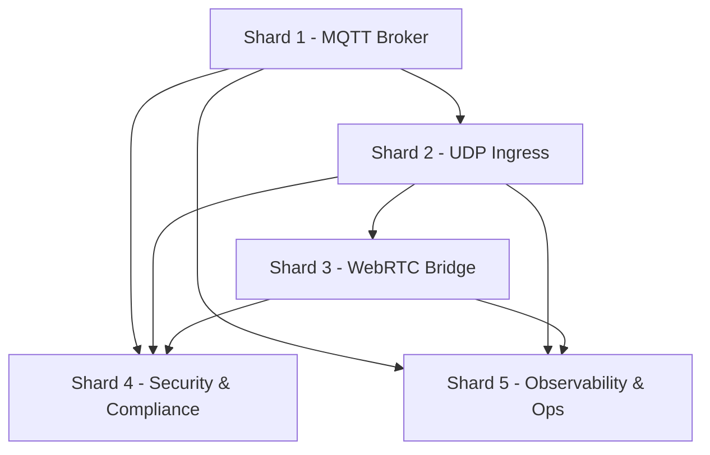

# Project Architecture Document – Zebbingo Protocol Upgrade

**Owner:** @architect\
**Date:** 2025-08-28\
**Status:** Draft

---

## 1) Objectives & SLOs

- **Latency:** cloud→device command P95 ≤ 250 ms; device→ASR one-way median ≤ 80 ms.
- **Reliability:** 30-day device availability ≥ 99.5%; command success ≥ 99.9%/24h.
- **Scalability:** 10k concurrent devices; 1k active talkers.
- **Security:** 100% of traffic encrypted; per-device auth.
- **Compliance:** GDPR/COPPA retention defaults; parental controls for export/delete.

---

## 2) Architectural Principles

- **Secure-by-default:** TLS/mTLS, DTLS-PSK, DTLS-SRTP mandatory.
- **Minimal device footprint:** ESP32 firmware optimized for 16 kHz Opus; offload heavy tasks to cloud.
- **Cloud scalability:** stateless ingress, broker clustering, autoscaling.
- **Portability:** portable topic schema across brokers.
- **Observability:** metrics, logs, and tracing are first-class.

---

## 3) High-Level Architecture

```mermaid
flowchart LR
    child([Child User])
    device[Zebbingo Speaker ESP32]
    broker[MQTT Broker<br>AWS IoT Core / EMQX]
    udp[Voice Ingress<br>UDP DTLS-PSK]
    asr[ASR Service]
    llm[LLM Service (Dify)]
    tts[TTS Service (Minimax)]
    parent[Parent App]
    api[Parental Dashboard & APIs]
    sfu[WebRTC Bridge/SFU]

    child --> device
    device -- MQTT (mTLS) --> broker
    device -- UDP (DTLS-PSK) --> udp
    udp --> asr --> llm --> tts --> udp
    broker --> api --> parent
    parent <---> sfu
    udp --> sfu
```

---

## 4) Subsystem Decomposition

### Control Plane (MQTT)

- Broker: AWS IoT Core (prod), EMQX (staging), Mosquitto (local).
- Topics: status, cmd, ack, cfg, ota, telemetry.
- Auth: mTLS, per-device certs, topic ACLs.

### Data Plane (UDP)

- Transport: UDP + DTLS-PSK.
- Packet format: header + Opus frame (16 kHz, 20 ms).
- Reliability: jitter buffer, FEC, drop late >200 ms.

### WebRTC (Optional)

- Bridge: Go/Pion or LiveKit.
- Transcode: 16 kHz → 48 kHz.
- Features: NAT traversal via STUN/TURN, DTLS-SRTP.

### Security & Compliance

- Cert lifecycle, PSK rotation, audit logging.
- Privacy defaults: audio ≤14 d opt-in; logs ≤90 d.

### Observability & Ops

- Metrics: MQTT sessions, UDP jitter/loss, WebRTC RTT.
- Logs: structured JSON.
- Traces: OTel spans across ingress→ASR→LLM→TTS.

---

## 5) Data Flows

### Voice Q&A

1. Device detects wakeword.
2. Streams Opus frames via UDP DTLS-PSK.
3. Ingress → ASR → LLM (Dify) → TTS (Minimax).
4. Audio chunks streamed back to device.

### OTA Update

1. Broker publishes manifest on `/ota`.
2. Device fetches via HTTPS.
3. Verifies checksum/signature.
4. Updates firmware, reboots, acks.

### WebRTC Monitoring

1. App requests session.
2. Bridge establishes PC via ICE/STUN/TURN.
3. Transcoded audio forwarded to app.

---

## 6) Technology Choices

- **Broker:** AWS IoT Core (prod), EMQX (staging).
- **Codec:** Opus 16 kHz on device, 48 kHz on WebRTC.
- **Security:** MQTT mTLS; UDP DTLS-PSK; WebRTC DTLS-SRTP.
- **ASR:** pluggable (initial Whisper RT).
- **LLM:** Dify at studio.zebbie.ai.
- **TTS:** Minimax (primary).
- **Infra:** Kubernetes (EKS), autoscaling ingress.

### Minimax TTS API Contract

- **Input:** `POST /v1/tts` with `text` or SSML, `voice`, `lang`, `format` (opus/pcm16).
- **Output:** Streamed Opus frames (16 kHz mono), ≤20ms per chunk.
- **SLO:** First audio <500ms; sustained throughput <50ms per chunk.

---

## 7) Dependencies

- **Shard PRDs:** Control Plane, Data Plane, WebRTC Bridge, Security & Compliance, Observability.
- **Infra:** EMQX cluster, coturn servers, ingress gateways.
- **Compliance:** GDPR/COPPA audit.

### Dependency Map



---

## 8) Risks & Mitigations

- **NAT traversal issues:** fallback to TURN; TCP fallback via MQTT if blocked.
- **Device limits:** ESP32 cannot run full WebRTC; offload to bridge.
- **Relay costs:** monitor TURN usage; optimize with regional servers.
- **Key leakage:** rotate PSKs; revoke compromised certs.

---

## 9) Appendix – ADR Log References

- ADR-001: Control plane MQTT mTLS.
- ADR-002: Media plane UDP DTLS-PSK.
- ADR-003: Optional WebRTC bridge.
- ADR-004: TTS provider Minimax.
- ADR-005: Device 16 kHz Opus, bridge transcode to 48 kHz.
- ADR-006: TURN initial region APAC-SG.
- ADR-007: Privacy defaults (audio ≤14 d, logs ≤90 d).
- ADR-008: Broker strategy (AWS IoT, EMQX, Mosquitto).

---

## 10) Epics & User Stories with Acceptance Criteria

### Traceability Matrix
| FR/NFR | Epic | Stories |
|--------|------|---------|
| FR1 (MQTT mTLS connect) | Epic 1 – Control Plane | Story 1.1 |
| FR2 (Scoped topics) | Epic 1 – Control Plane | Story 1.1, 1.2 |
| FR3 (DTLS-PSK UDP) | Epic 2 – Data Plane | Story 2.1, 2.2 |
| FR4 (WebRTC transcoding) | Epic 3 – WebRTC Bridge | Story 3.1, 3.2 |
| FR5 (OTA update) | Epic 1 – Control Plane | Story 1.3 |
| FR6 (Telemetry errors) | Epic 2 – Data Plane | Story 2.2, 2.3 |
| FR7 (Parental dashboard telemetry) | Epic 4 – Security & Compliance | Story 4.3 |
| NFR1 (Latency) | Epic 2, 3 | Stories 2.1–2.3, 3.1, 3.2 |
| NFR2 (Reliability) | Epic 2 | Story 2.3 |
| NFR3 (Security) | Epic 1, 2, 3, 4 | Stories 1.1, 2.1, 3.2, 4.1 |
| NFR4 (Scalability) | Epic 5 – Observability & Ops | Stories 5.1, 5.2 |
| NFR5 (Privacy) | Epic 4 – Security & Compliance | Story 4.2, 4.3 |
| NFR6 (Observability) | Epic 5 – Observability & Ops | Stories 5.1–5.3 |

### Epic 1: Control Plane (MQTT)

- **Story 1.1:** As a device, I can establish a secure MQTT connection with mTLS so that I am uniquely identified.
  - **Given** a valid device certificate
  - **When** the device connects to the broker
  - **Then** the broker authenticates and authorizes the device on its topic subtree.

- **Story 1.2:** As a backend service, I can send commands on `/cmd` with QoS1 so that devices reliably execute instructions.
  - **Given** a command message with a `cmdId`
  - **When** the backend publishes to `/cmd`
  - **Then** the device receives it and publishes an ack with the same `cmdId`.

- **Story 1.3:** As a device, I receive OTA manifest on `/ota` and update firmware with checksum verification.
  - **Given** an OTA manifest is published
  - **When** the device downloads and verifies the firmware
  - **Then** the device installs it, reboots, and publishes an ack.

### Epic 2: Data Plane (UDP)
- **Story 2.1:** As a device, I can initiate a DTLS-PSK session and stream Opus 16kHz audio frames.
  - **Given** a valid PSK provisioned via MQTT
  - **When** the device initiates DTLS and streams audio
  - **Then** the ingress accepts packets and validates them.

- **Story 2.2:** As the UDP ingress, I can reorder, jitter-buffer, and decode packets so that ASR receives clean audio.
  - **Given** incoming UDP packets with sequence numbers
  - **When** they are processed by jitter buffer
  - **Then** the ASR receives ordered audio frames with <200 ms latency.

- **Story 2.3:** As a device, I can handle network loss and reconnect within 2s.
  - **Given** a network drop occurs
  - **When** the device reconnects
  - **Then** it resumes streaming within 2s without manual intervention.

### Epic 3: WebRTC Bridge
- **Story 3.1:** As a backend, I can transcode 16kHz Opus to 48kHz and forward via WebRTC for browser playback.
  - **Given** a UDP audio stream at 16kHz
  - **When** the bridge receives packets
  - **Then** it transcodes and publishes them at 48kHz over WebRTC.

- **Story 3.2:** As an app user, I can connect over WebRTC with ICE/STUN/TURN and monitor device audio.
  - **Given** valid credentials and signaling
  - **When** the app establishes a peer connection
  - **Then** the app receives audio within 10ms added latency.

### Epic 4: Security & Compliance
- **Story 4.1:** As a device, I authenticate with a per-device cert so that only valid devices connect.
  - **Given** a valid device certificate
  - **When** the device connects via MQTT
  - **Then** only authorized topics are accessible.

- **Story 4.2:** As a compliance officer, I can enforce data retention limits (logs 90d, audio 14d) so regulations are met.
  - **Given** retention policies are configured
  - **When** data exceeds its retention period
  - **Then** it is deleted or anonymized automatically.

- **Story 4.3:** As a parent, I can delete/export child data from dashboard to comply with GDPR/COPPA.
  - **Given** a parent request from the dashboard
  - **When** delete/export is triggered
  - **Then** backend fulfills within 30 days.

### Epic 5: Observability & Ops
- **Story 5.1:** As an SRE, I can see MQTT sessions, UDP packet loss, and WebRTC stats on Grafana dashboards.
  - **Given** metrics exporters deployed
  - **When** dashboards are queried
  - **Then** real-time status is displayed.

- **Story 5.2:** As an SRE, I receive alerts when UDP loss >5% or ICE failures exceed 5%.
  - **Given** alert thresholds configured
  - **When** error conditions occur
  - **Then** on-call is paged with actionable alerts.

- **Story 5.3:** As a developer, I can trace a request from device→ASR→LLM→TTS with OTel.
  - **Given** tracing is enabled
  - **When** a session occurs
  - **Then** spans show full path with <1% missing traces.

---

## 11) Ops Runbooks

- **Broker outage:** Failover to secondary broker; notify on-call; escalate if >10 min.
- **UDP loss >10% sustained:** Verify Wi-Fi environment; fallback to WebRTC/TURN.
- **TURN failure:** Verify coturn service health; failover to backup region.
- **Key leakage:** Rotate PSKs; revoke certs; invalidate MQTT sessions.

---

## 12) Capacity & Cost Guardrails

- **AWS IoT Core ops:** Alert if >10M msgs/day.
- **TURN relay GB:** Alert if >2TB/month per region.
- **Egress bandwidth:** Alert if >5TB/month.
- **Budget hooks:** AWS Budgets + Grafana dashboards.

---

## 13) Compliance Checkpoint

- Before canary >10% rollout, require **DPO/legal sign-off** of retention policies and parental dashboard flows.

---

## 14) PO Execution Checklist (2025-08-28 SGT)

| Item                           | Status | Notes                                               | Action                                        |
| ------------------------------ | ------ | --------------------------------------------------- | --------------------------------------------- |
| Background & Problem Statement | ✅      | Clear rationale for MQTT+UDP + optional WebRTC      | —                                             |
| Success Criteria               | ✅      | Latency/availability targets defined                | —                                             |
| Functional Requirements        | ✅      | FR1–FR7 captured                                    | Keep synced as scope evolves                  |
| Non-Functional Requirements    | ✅      | Latency, reliability, security, privacy, scale      | —                                             |
| Out of Scope                   | ✅      | Explicitly listed                                   | —                                             |
| Architecture Overview          | ✅      | Broker, UDP ingress, WebRTC bridge                  | Link to Architecture Doc for diagrams         |
| Security & Privacy             | ✅      | mTLS, DTLS-PSK, DTLS-SRTP; retention defaults       | Add Minimax TTS API contract (inputs/outputs) |
| Data Retention & DSR           | ✅      | Audio ≤14d opt-in; logs ≤90d; export/delete         | Hook dashboard endpoints to backend jobs      |
| Dependencies                   | ⚠️     | Shard PRDs exist; inter-shard dependencies implicit | Dependency map added to Master Pack           |
| Risks & Mitigations            | ✅      | Covered (NAT, packet loss, device limits, keys)     | —                                             |
| Test Plan                      | ✅      | Unit/integration/load/chaos/security                | Add pass/fail gates per SLO                   |
| Acceptance Criteria            | ✅      | Per-story Given/When/Then AC added                 | —                                             |
| Rollout & Rollback             | ✅      | Cohort plan + `/cfg` rollback                       | Define go/no-go gates per cohort              |
| Stakeholders & Ownership       | ✅      | Listed + milestones with owners                     | Add DRIs per milestone                        |
| Observability                  | ✅      | Metrics/logs/traces + alert thresholds              | Add WebRTC stats export wiring                |
| Localization/Internationalization | ⚠️  | Not in PRD scope                                    | Confirm N/A or add locale telemetry fields    |
| Accessibility & Safety (Kids)  | ⚠️     | Outside protocol scope                              | Link to content/safety PRD; add guardrail hooks|
| Support/Runbooks               | ✅      | Runbooks added                                      | Keep them updated with Ops team               |
| Cost & Capacity                | ✅      | Cost guardrails defined                             | Monitor alerts & budgets                      |
| Legal/Compliance Sign-off      | ⚠️     | Defaults set; sign-off milestone added              | Execute checkpoint before canary ramp         |

---

## QA Testing Matrix with Expected Results

| FR/NFR | Test Case | Owner | Expected Result | Pass/Fail Criteria |
|--------|-----------|-------|-----------------|--------------------|
| FR1 (MQTT mTLS connect) | Device connects with valid/invalid cert; verify broker auth | QA Firmware | Valid cert connects; invalid cert rejected | Pass if valid succeeds and invalid fails |
| FR2 (Scoped topics) | Publish outside scope; expect ACL deny | QA Backend | Unauthorized publish denied | Pass if broker denies unauthorized topic |
| FR3 (DTLS-PSK UDP) | Establish DTLS with valid/invalid PSK; stream audio | QA Firmware | Valid PSK succeeds; invalid PSK handshake fails | Pass if only valid PSK streams accepted |
| FR4 (WebRTC transcoding) | Send 16kHz stream; verify 48kHz output on browser | QA Backend | Browser receives 48kHz Opus audio | Pass if browser receives and plays audio |
| FR5 (OTA update) | Publish manifest; device downloads, verifies, applies update | QA Firmware | Device applies update, reboots, sends ack | Pass if checksum verified + ack sent |
| FR6 (Telemetry errors) | Device sends error; backend ingests and displays | QA Backend | Error appears in telemetry logs | Pass if logs contain correct error entry |
| FR7 (Parental dashboard telemetry) | Trigger usage; verify dashboard updated | QA App | Dashboard updates with usage stats | Pass if metrics match generated usage |
| NFR1 (Latency) | Measure RTT and audio latency under load | QA Perf | RTT ≤250ms; audio latency ≤80ms | Pass if within thresholds |
| NFR2 (Reliability) | Induce network flap; verify reconnect ≤2s | QA Perf | Device reconnects ≤2s | Pass if reconnect consistently ≤2s |
| NFR3 (Security) | Attempt MITM; verify TLS/DTLS rejection | QA Security | MITM attempt fails; connection refused | Pass if all MITM blocked |
| NFR4 (Scalability) | Simulate 10k clients; measure broker/ingress stability | QA Perf | System handles load; error rate ≤1% | Pass if load test stable under target |
| NFR5 (Privacy) | Exceed retention period; verify auto-delete | QA Compliance | Data auto-deleted/anonymized | Pass if no retained data beyond limits |
| NFR6 (Observability) | Check Grafana dashboards show metrics/traces | QA SRE | Dashboards display real-time data | Pass if metrics/traces visible and accurate |

---

## Notes
- Each test case must include logs, screenshots, or metrics export as evidence.  
- Failures require creating a Jira issue linked to the FR/NFR ID.  